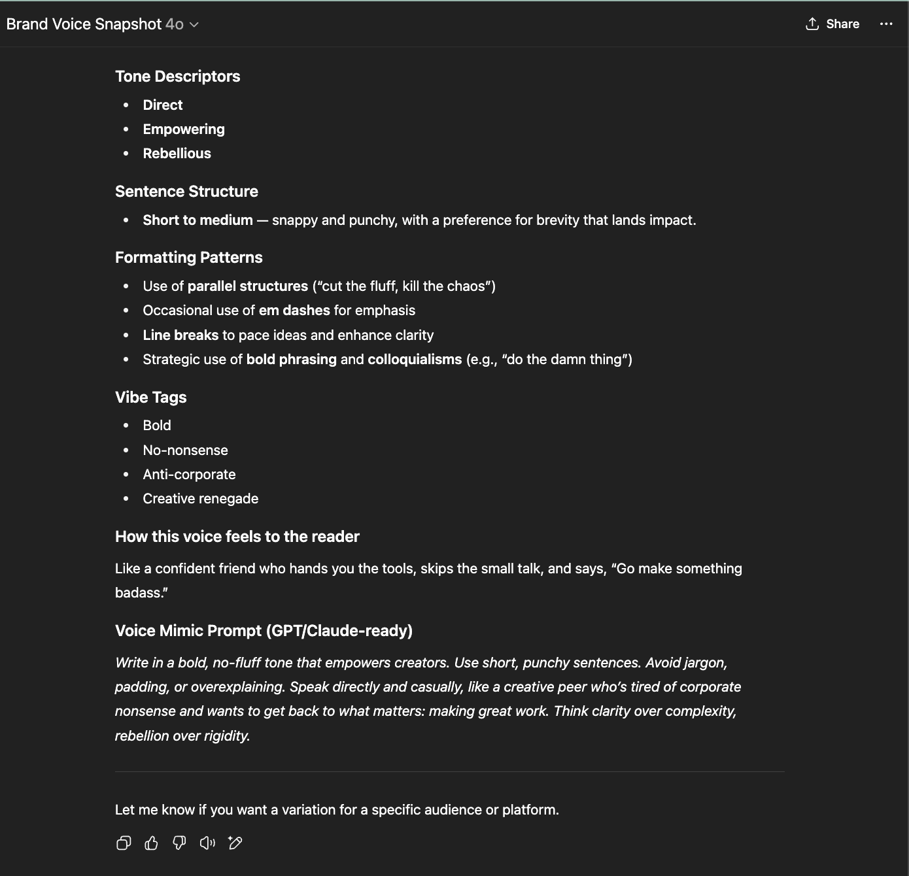

# 🧠 Brand Voice Snapshot (GPT)

Brand Voice Snapshot is a custom GPT that instantly analyzes the tone and style of your brand's writing — helping founders, marketers, and AI trainers create consistent, aligned messaging at scale.

Just paste 3–5 sample blurbs, and it generates a structured summary of:

- 🌟 Tone Descriptors (e.g. confident, rebellious, warm)
- ✍️ Sentence Style (e.g. short, punchy, lyrical)
- 🎨 Formatting Patterns (e.g. emojis, lists, line breaks)
- 🔖 Vibe Tags (e.g. quirky, polished, anti-corporate)
- 💡 Emotional Impact (how the tone feels to readers)
- 🧹 Bonus: a GPT-ready prompt snippet to replicate the brand voice

---

## 🚀 How It Works

**Step 1:** Open the GPT → [Brand Voice Snapshot](https://chatgpt.com/g/g-688d86dd33f48191b9f1ac2beb93c8c9-brand-voice-snapshot?model=gpt-4o)  
**Step 2:** Paste in 3–5 writing samples from your brand  
**Step 3:** Get a structured tone report + voice mimic prompt  
**Optional:** Ask for platform-specific variations (e.g. for social media vs website copy)

---

## 📥 Sample Input

---

## Example 1

```
We believe creative freedom isn’t optional—it’s the whole point.
Our tools are here to simplify, clarify, and get the hell out of your way.
```

## Example 2

```
Creativity shouldn’t come with a manual or a muzzle.
We build tools that cut the fluff, kill the chaos, and get you back to making cool shit that matters.
```

## Example 3

```
We don’t do fluff, funnels, or 47-step frameworks.
We build tools for people who’d rather do the damn thing than overthink it.
Less performative. More powerful.
```

## Example 4

```
Your ideas deserve clarity, not corporate jargon.
If our tools can’t make things simpler, they’re not worth building.
```

---

## 📤 Sample Output



**Tone Descriptors:**  
- Direct  
- Empowering  
- Rebellious

**Sentence Structure:**  
Short to medium — snappy and punchy, with a preference for brevity that lands impact.

**Formatting Patterns:**  
- Parallel structures (“cut the fluff, kill the chaos”)  
- Em dashes for emphasis  
- Line breaks for clarity  
- Bold phrasing and colloquialisms (“do the damn thing”)

**Vibe Tags:**  
- Bold  
- No-nonsense  
- Anti-corporate  
- Creative renegade

**Emotional Impact:**  
> Like a confident friend who hands you the tools, skips the small talk, and says, “Go make something badass.”

**Voice Mimic Prompt:**  
Write in a bold, no-fluff tone that empowers creators. Use short, punchy sentences. Avoid jargon, padding, or overexplaining. Speak directly and casually, like a creative peer who’s tired of corporate nonsense and wants to get back to what matters: making great work. Think clarity over complexity, rebellion over rigidity.

---

## 🧪 Use Cases

- ✍️ Founders documenting brand voice for the first time  
- 🧠 AI trainers building tone-aligned GPTs or Claude bots  
- 🧑‍🎨 Creative teams needing tone audits for client copy  
- 📢 Marketers improving consistency across platforms

---

## 🛠 Tech Stack

| Layer        | Tool                             |
|--------------|----------------------------------|
| **LLM**      | GPT-4 (ChatGPT), Claude optional |
| **Interface**| ChatGPT GPT + (optionally Replit / Notion / n8n) |
| **Output**   | Markdown / JSON / Text           |
| **Hosting**  | ChatGPT-native or Local/Cloud    |

---

## 🧹 Prompt Template

```text
You are a brand voice analyst.  
Analyze the following writing sample and return a structured summary with:
- Tone descriptors (max 3)  
- Sentence structure (short, medium, long)  
- Formatting patterns (e.g., lists, emojis, line breaks)  
- Vibe tags (quirky, bold, calm, etc.)  
- A sentence about how this voice might feel to a reader  
- Bonus: A GPT/Claude-ready prompt to mimic this style

[Insert writing sample here]
```

---

## 🧪 Use Cases
- ✍️ Founders documenting brand voice for the first time  
- 🤖 AI trainers building tone-aligned GPTs or Claude bots  
- 🧑‍🎨 Creative teams auditing voice for marketing materials  
- 📢 Marketers improving consistency across platforms  

---

## 📸 Screenshots

- **Intro Prompt** → User asks: _"I need you to study this brand voice"_  
  → GPT asks for up to 5 samples (Screenshot: `brand-voice-input.png`)

- **Final Output** → Brand Voice Analysis (Screenshot: `brand-voice-output.png`)

---


<!---## 🔍 Brand Voice in Action

This demo showcases how Brand Voice Snapshot analyzes public-facing content from recognizable brands:

| Brand     | Tone Type | Key Traits Identified by Snapshot                     |
|-----------|-----------|--------------------------------------------------------|
| Duolingo  | Loud      | Playful, bold, meme-driven                            |
| Notion    | Mid       | Structured, warm, precise                             |
| Zapier    | Quiet     | Neutral, frictionless, utilitarian                    |

> “AI agents can’t afford to flatten brand voice. Snapshot ensures even subtle tonal strategies are recognized and respected — whether your brand shouts, whispers, or explains.”
--->


## 🏗 Status: MVP v1

This is the first iteration of the tool.

### Planned Enhancements:

- Add web form input (Notion, Replit, or site embed)
- Markdown and JSON export
- Training-ready voice profile format

---

## 👤 Creator

Built by **Ros Talbot**  
Part of the **AI Agent Bootcamp, 2025**

> _Originally developed as “Vibe Agent 02” in the Micro Vibe Projects series._
